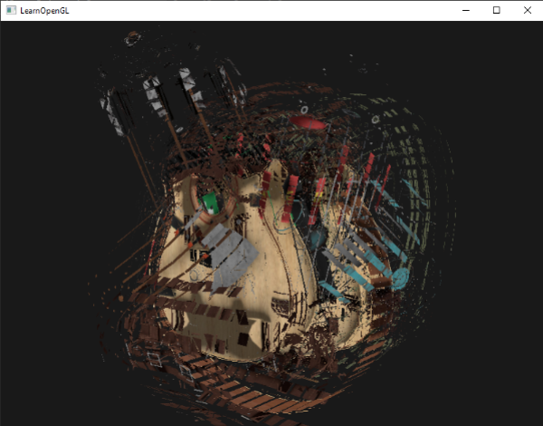

# 几何着色器

原文     | [Geometry Shader](http://learnopengl.com/#!Advanced-OpenGL/Geometry-Shader)
      ---|---
作者     | JoeyDeVries
翻译     | Krasjet
校对     | 暂未校对

在顶点和片段着色器之间有一个可选的<def>几何着色器</def>(Geometry Shader)，几何着色器的输入是一个图元（如点或三角形）的一组顶点。几何着色器可以在顶点发送到下一着色器阶段之前对它们随意变换。然而，几何着色器最有趣的地方在于，它能够将（这一组）顶点变换为完全不同的图元，并且还能生成比原来更多的顶点。

废话不多说，我们直接先看一个几何着色器的例子：

```c++
#version 330 core
layout (points) in;
layout (line_strip, max_vertices = 2) out;

void main() {    
    gl_Position = gl_in[0].gl_Position + vec4(-0.1, 0.0, 0.0, 0.0); 
    EmitVertex();

    gl_Position = gl_in[0].gl_Position + vec4( 0.1, 0.0, 0.0, 0.0);
    EmitVertex();
    
    EndPrimitive();
}
```

在几何着色器的顶部，我们需要声明从顶点着色器输入的图元类型。这需要在<fun>in</fun>关键字前声明一个布局修饰符(Layout Qualifier)。这个输入布局修饰符可以从顶点着色器接收下列任何一个图元值：

- `points`：绘制<var>GL_POINTS</var>图元时（1）。
- `lines`：绘制<var>GL_LINES</var>或<var>GL_LINE_STRIP</var>时（2）
- `lines_adjacency`：<var>GL_LINES_ADJACENCY</var>或<var>GL_LINE_STRIP_ADJACENCY</var>（4）
- `triangles`：<var>GL_TRIANGLES</var>、<var>GL_TRIANGLE_STRIP</var>或<var>GL_TRIANGLE_FAN</var>（3）
- `triangles_adjacency`：<var>GL_TRIANGLES_ADJACENCY</var>或<var>GL_TRIANGLE_STRIP_ADJACENCY</var>（6）

以上是能提供给<fun>glDrawArrays</fun>渲染函数的几乎所有图元了。如果我们想要将顶点绘制为<var>GL_TRIANGLES</var>，我们就要将输入修饰符设置为`triangles`。括号内的数字表示的是一个图元所包含的最小顶点数。

接下来，我们还需要指定几何着色器输出的图元类型，这需要在<fun>out</fun>关键字前面加一个布局修饰符。和输入布局修饰符一样，输出布局修饰符也可以接受几个图元值：

- `points`
- `line_strip`
- `triangle_strip`

有了这3个输出修饰符，我们就可以使用输入图元创建几乎任意的形状了。要生成一个三角形的话，我们将输出定义为`triangle_strip`，并输出3个顶点。

几何着色器同时希望我们设置一个它最大能够输出的顶点数量（如果你超过了这个值，OpenGL将不会绘制**多出的**顶点），这个也可以在<fun>out</fun>关键字的布局修饰符中设置。在这个例子中，我们将输出一个`line_strip`，并将最大顶点数设置为2个。

!!! important

    如果你不知道什么是线条(Line Strip)：线条连接了一组点，形成一条连续的线，它最少要由两个点来组成。在渲染函数中每多加一个点，就会在这个点与前一个点之间形成一条新的线。在下面这张图中，我们有5个顶点：

    

为了生成更有意义的结果，我们需要某种方式来获取前一着色器阶段的输出。GLSL提供给我们一个名为<fun>gl_in</fun>的<def>内建</def>(Built-in)变量，在内部看起来（可能）是这样的：

```c++
in gl_Vertex
{
    vec4  gl_Position;
    float gl_PointSize;
    float gl_ClipDistance[];
} gl_in[];
```

这里，它被声明为一个<def>接口块</def>（Interface Block，我们在[上一节](08 Advanced GLSL.md)已经讨论过），它包含了几个很有意思的变量，其中最有趣的一个是<var>gl_Position</var>，它是和顶点着色器输出非常相似的一个向量。

要注意的是，它被声明为一个数组，因为大多数的渲染图元包含多于1个的顶点，而几何着色器的输入是一个图元的**所有**顶点。

有了之前顶点着色器阶段的顶点数据，我们就可以使用2个几何着色器函数，<fun>EmitVertex</fun>和<fun>EndPrimitive</fun>，来生成新的数据了。几何着色器希望你能够生成并输出至少一个定义为输出的图元。在我们的例子中，我们需要至少生成一个线条图元。

```c++
void main() {
    gl_Position = gl_in[0].gl_Position + vec4(-0.1, 0.0, 0.0, 0.0); 
    EmitVertex();

    gl_Position = gl_in[0].gl_Position + vec4( 0.1, 0.0, 0.0, 0.0);
    EmitVertex();
    
    EndPrimitive();
}
```

每次我们调用<fun>EmitVertex</fun>时，<var>gl_Position</var>中的向量会被添加到图元中来。当<fun>EndPrimitive</fun>被调用时，所有发射出的(Emitted)顶点都会合成为指定的输出渲染图元。在一个或多个<fun>EmitVertex</fun>调用之后重复调用<fun>EndPrimitive</fun>能够生成多个图元。在这个例子中，我们发射了两个顶点，它们从原始顶点位置平移了一段距离，之后调用了<fun>EndPrimitive</fun>，将这两个顶点合成为一个包含两个顶点的线条。

现在你（大概）了解了几何着色器的工作方式，你可能已经猜出这个几何着色器是做什么的了。它接受一个点图元作为输入，以这个点为中心，创建一条水平的线图元。如果我们渲染它，看起来会是这样的：


目前还并没有什么令人惊叹的效果，但考虑到这个输出是通过调用下面的渲染函数来生成的，它还是很有意思的：

```c++
glDrawArrays(GL_POINTS, 0, 4);
```

虽然这是一个比较简单的例子，它的确向你展示了如何能够使用几何着色器来（动态地）生成新的形状。在之后我们会利用几何着色器创建出更有意思的效果，但现在我们仍将从创建一个简单的几何着色器开始。

## 使用几何着色器

为了展示几何着色器的用法，我们将会渲染一个非常简单的场景，我们只会在标准化设备坐标的z平面上绘制四个点。这些点的坐标是：

```c++
float points[] = {
	-0.5f,  0.5f, // 左上
	 0.5f,  0.5f, // 右上
	 0.5f, -0.5f, // 右下
	-0.5f, -0.5f  // 左下
};
```

顶点着色器只需要在z平面绘制点就可以了，所以我们将使用一个最基本顶点着色器：

```c++
#version 330 core
layout (location = 0) in vec2 aPos;

void main()
{
    gl_Position = vec4(aPos.x, aPos.y, 0.0, 1.0); 
}
```

直接在片段着色器中硬编码，将所有的点都输出为绿色：

```c++
#version 330 core
out vec4 FragColor;

void main()
{
    FragColor = vec4(0.0, 1.0, 0.0, 1.0);   
}
```

为点的顶点数据生成一个VAO和一个VBO，然后使用<fun>glDrawArrays</fun>进行绘制：

```c++
shader.use();
glBindVertexArray(VAO);
glDrawArrays(GL_POINTS, 0, 4);
```

结果是在黑暗的场景中有四个（很难看见的）绿点：


但我们之前不是学过这些吗？是的，但是现在我们将会添加一个几何着色器，为场景添加活力。

出于学习目的，我们将会创建一个<def>传递</def>(Pass-through)几何着色器，它会接收一个点图元，并直接将它**传递**(Pass)到下一个着色器：

```c++
#version 330 core
layout (points) in;
layout (points, max_vertices = 1) out;

void main() {    
    gl_Position = gl_in[0].gl_Position; 
    EmitVertex();
    EndPrimitive();
}
```

现在这个几何着色器应该很容易理解了，它只是将它接收到的顶点位置不作修改直接发射出去，并生成一个点图元。

和顶点与片段着色器一样，几何着色器也需要编译和链接，但这次在创建着色器时我们将会使用<var>GL_GEOMETRY_SHADER</var>作为着色器类型：

```c++
geometryShader = glCreateShader(GL_GEOMETRY_SHADER);
glShaderSource(geometryShader, 1, &gShaderCode, NULL);
glCompileShader(geometryShader);  
...
glAttachShader(program, geometryShader);
glLinkProgram(program);
```

着色器编译的代码和顶点与片段着色器代码都是一样的。记得要检查编译和链接错误！

如果你现在编译并运行程序，会看到和下面类似的结果：


这和没使用几何着色器时是完全一样的！我承认这是有点无聊，但既然我们仍然能够绘制这些点，所以几何着色器是正常工作的，现在是时候做点更有趣的东西了！

## 造几个房子

绘制点和线并没有那么有趣，所以我们会使用一点创造力，利用几何着色器在每个点的位置上绘制一个房子。要实现这个，我们可以将几何着色器的输出设置为<def>triangle_strip</def>，并绘制三个三角形：其中两个组成一个正方形，另一个用作房顶。

OpenGL中，三角形带(Triangle Strip)是绘制三角形更高效的方式，它使用顶点更少。在第一个三角形绘制完之后，每个后续顶点将会在上一个三角形边上生成另一个三角形：每3个临近的顶点将会形成一个三角形。如果我们一共有6个构成三角形带的顶点，那么我们会得到这些三角形：(1, 2, 3)、(2, 3, 4)、(3, 4, 5)和(4, 5, 6)，共形成4个三角形。一个三角形带至少需要3个顶点，并会生成N-2个三角形。使用6个顶点，我们创建了6-2 = 4个三角形。下面这幅图展示了这点：


通过使用三角形带作为几何着色器的输出，我们可以很容易创建出需要的房子形状，只需要以正确的顺序生成3个相连的三角形就行了。下面这幅图展示了顶点绘制的顺序，蓝点代表的是输入点：


变为几何着色器是这样的：

```c++
#version 330 core
layout (points) in;
layout (triangle_strip, max_vertices = 5) out;

void build_house(vec4 position)
{    
    gl_Position = position + vec4(-0.2, -0.2, 0.0, 0.0);    // 1:左下
    EmitVertex();   
    gl_Position = position + vec4( 0.2, -0.2, 0.0, 0.0);    // 2:右下
    EmitVertex();
    gl_Position = position + vec4(-0.2,  0.2, 0.0, 0.0);    // 3:左上
    EmitVertex();
    gl_Position = position + vec4( 0.2,  0.2, 0.0, 0.0);    // 4:右上
    EmitVertex();
    gl_Position = position + vec4( 0.0,  0.4, 0.0, 0.0);    // 5:顶部
    EmitVertex();
    EndPrimitive();
}

void main() {    
    build_house(gl_in[0].gl_Position);
}
```

这个几何着色器生成了5个顶点，每个顶点都是原始点的位置加上一个偏移量，来组成一个大的三角形带。最终的图元会被光栅化，然后片段着色器会处理整个三角形带，最终在每个绘制的点处生成一个绿色房子：


你可以看到，每个房子实际上是由3个三角形组成的——全部都是使用空间中一点来绘制的。这些绿房子看起来是有点无聊，所以我们会再给每个房子分配一个不同的颜色。为了实现这个，我们需要在顶点着色器中添加一个额外的顶点属性，表示颜色信息，将它传递至几何着色器，并再次发送到片段着色器中。

下面是更新后的顶点数据：

```c++
float points[] = {
    -0.5f,  0.5f, 1.0f, 0.0f, 0.0f, // 左上
     0.5f,  0.5f, 0.0f, 1.0f, 0.0f, // 右上
     0.5f, -0.5f, 0.0f, 0.0f, 1.0f, // 右下
    -0.5f, -0.5f, 1.0f, 1.0f, 0.0f  // 左下
};
```

然后我们更新顶点着色器，使用一个接口块将颜色属性发送到几何着色器中：

```c++
#version 330 core
layout (location = 0) in vec2 aPos;
layout (location = 1) in vec3 aColor;

out VS_OUT {
    vec3 color;
} vs_out;

void main()
{
    gl_Position = vec4(aPos.x, aPos.y, 0.0, 1.0); 
    vs_out.color = aColor;
}
```

接下来我们还需要在几何着色器中声明相同的接口块（使用一个不同的接口名）：

```c++
in VS_OUT {
    vec3 color;
} gs_in[];
```

因为几何着色器是作用于输入的一组顶点的，从顶点着色器发来输入数据总是会以数组的形式表示出来，即便我们现在只有一个顶点。

!!! Important

	我们并不是必须要用接口块来向几何着色器传递数据。我们也可以这样写：

		in vec3 vColor[];

	如果顶点着色器发送的颜色向量是`out vec3 vColor`，那这么写就没问题。然而，接口块在几何着色器这样的着色器中会更容易处理一点。实际上，几何着色器的输入能够变得非常大，将它们合并为一个大的接口块数组会更符合逻辑一点。

接下来我们还需要为下个片段着色器阶段声明一个输出颜色向量：

```c++
out vec3 fColor;
```

因为片段着色器只需要一个（插值的）颜色，发送多个颜色并没有什么意义。所以，<var>fColor</var>向量就不是一个数组，而是一个单独的向量。当发射一个顶点的时候，每个顶点将会使用最后在<var>fColor</var>中储存的值，来用于片段着色器的运行。对我们的房子来说，我们只需要在第一个顶点发射之前，使用顶点着色器中的颜色填充<var>fColor</var>一次就可以了。

```c++
fColor = gs_in[0].color; // gs_in[0] 因为只有一个输入顶点
gl_Position = position + vec4(-0.2, -0.2, 0.0, 0.0);    // 1:左下  
EmitVertex();   
gl_Position = position + vec4( 0.2, -0.2, 0.0, 0.0);    // 2:右下
EmitVertex();
gl_Position = position + vec4(-0.2,  0.2, 0.0, 0.0);    // 3:左上
EmitVertex();
gl_Position = position + vec4( 0.2,  0.2, 0.0, 0.0);    // 4:右上
EmitVertex();
gl_Position = position + vec4( 0.0,  0.4, 0.0, 0.0);    // 5:顶部
EmitVertex();
EndPrimitive();  
```

所有发射出的顶点都将嵌有最后储存在<var>fColor</var>中的值，即顶点的颜色属性值。所有的房子都会有它们自己的颜色了：


仅仅是为了有趣，我们也可以假装这是冬天，将最后一个顶点的颜色设置为白色，给屋顶落上一些雪。

```c++
fColor = gs_in[0].color; 
gl_Position = position + vec4(-0.2, -0.2, 0.0, 0.0);    // 1:左下 
EmitVertex();   
gl_Position = position + vec4( 0.2, -0.2, 0.0, 0.0);    // 2:右下
EmitVertex();
gl_Position = position + vec4(-0.2,  0.2, 0.0, 0.0);    // 3:左上
EmitVertex();
gl_Position = position + vec4( 0.2,  0.2, 0.0, 0.0);    // 4:右上
EmitVertex();
gl_Position = position + vec4( 0.0,  0.4, 0.0, 0.0);    // 5:顶部
fColor = vec3(1.0, 1.0, 1.0);
EmitVertex();
EndPrimitive();  
```

最终结果看起来是这样的：


你可以将你的代码与[这里](https://learnopengl.com/code_viewer_gh.php?code=src/4.advanced_opengl/9.1.geometry_shader_houses/geometry_shader_houses.cpp)的OpenGL代码进行比对。

你可以看到，有了几何着色器，你甚至可以将最简单的图元变得十分有创意。因为这些形状是在GPU的超快硬件中动态生成的，这会比在顶点缓冲中手动定义图形要高效很多。因此，几何缓冲对简单而且经常重复的形状来说是一个很好的优化工具，比如体素(Voxel)世界中的方块和室外草地的每一根草。

# 爆破物体

尽管绘制房子非常有趣，但我们不会经常这么做。这也是为什么我们接下来要继续深入，来爆破(Explode)物体！虽然这也是一个不怎么常用的东西，但是它能向你展示几何着色器的强大之处。

当我们说**爆破**一个物体时，我们并不是指要将宝贵的顶点集给炸掉，我们是要将每个三角形沿着法向量的方向移动一小段时间。效果就是，整个物体看起来像是沿着每个三角形的法线向量**爆炸**一样。爆炸三角形的效果在纳米装模型上看起来像是这样的：



这样的几何着色器效果的一个好处就是，无论物体有多复杂，它都能够应用上去。

因为我们想要沿着三角形的法向量位移每个顶点，我们首先需要计算这个法向量。我们所要做的是计算垂直于三角形表面的向量，仅使用我们能够访问的3个顶点。你可能还记得在[变换](../01 Getting started/07 Transformations.md)小节中，我们使用<def>叉乘</def>来获取垂直于其它两个向量的一个向量。如果我们能够获取两个平行于三角形表面的向量<var>a</var>和<var>b</var>，我们就能够对这两个向量进行叉乘来获取法向量了。下面这个几何着色器函数做的正是这个，来使用3个输入顶点坐标来获取法向量：

```c++
vec3 GetNormal()
{
   vec3 a = vec3(gl_in[0].gl_Position) - vec3(gl_in[1].gl_Position);
   vec3 b = vec3(gl_in[2].gl_Position) - vec3(gl_in[1].gl_Position);
   return normalize(cross(a, b));
}
```

这里我们使用减法获取了两个平行于三角形表面的向量<var>a</var>和<var>b</var>。因为两个向量相减能够得到这两个向量之间的差值，并且三个点都位于三角平面上，对任意两个向量相减都能够得到一个平行于平面的向量。注意，如果我们交换了<fun>cross</fun>函数中<var>a</var>和<var>b</var>的位置，我们会得到一个指向相反方向的法向量——这里的顺序很重要！

既然知道了如何计算法向量了，我们就能够创建一个<fun>explode</fun>函数了，它使用法向量和顶点位置向量作为参数。这个函数会返回一个新的向量，它是位置向量沿着法线向量进行位移之后的结果：

```c++
vec4 explode(vec4 position, vec3 normal)
{
    float magnitude = 2.0;
    vec3 direction = normal * ((sin(time) + 1.0) / 2.0) * magnitude; 
    return position + vec4(direction, 0.0);
}
```

函数本身应该不是非常复杂。<fun>sin</fun>函数接收一个<var>time</var>参数，它根据时间返回一个-1.0到1.0之间的值。因为我们不想让物体**向内爆炸**(Implode)，我们将sin值变换到了[0, 1]的范围内。最终的结果会乘以<var>normal</var>向量，并且最终的<var>direction</var>向量会被加到位置向量上。

当使用我们的[模型加载器](../03 Model Loading/01 Assimp.md)绘制一个模型时，<def>爆破</def>(Explode)效果的完整几何着色器是这样的：

```c++
#version 330 core
layout (triangles) in;
layout (triangle_strip, max_vertices = 3) out;

in VS_OUT {
    vec2 texCoords;
} gs_in[];

out vec2 TexCoords; 

uniform float time;

vec4 explode(vec4 position, vec3 normal) { ... }

vec3 GetNormal() { ... }

void main() {    
    vec3 normal = GetNormal();

    gl_Position = explode(gl_in[0].gl_Position, normal);
    TexCoords = gs_in[0].texCoords;
    EmitVertex();
    gl_Position = explode(gl_in[1].gl_Position, normal);
    TexCoords = gs_in[1].texCoords;
    EmitVertex();
    gl_Position = explode(gl_in[2].gl_Position, normal);
    TexCoords = gs_in[2].texCoords;
    EmitVertex();
    EndPrimitive();
}
```

注意我们在发射顶点之前输出了对应的纹理坐标。

而且别忘了在OpenGL代码中设置<var>time</var>变量：

```c++
shader.setFloat("time", glfwGetTime());
```

最终的效果是，3D模型看起来随着时间不断在爆破它的顶点，在这之后又回到正常状态。虽然这并不是非常有用，它的确向你展示了几何着色器更高级的用法。你可以将你的代码和[这里](https://learnopengl.com/code_viewer_gh.php?code=src/4.advanced_opengl/9.2.geometry_shader_exploding/geometry_shader_exploding.cpp)完整的源码进行比较。

# 法向量可视化

在这一部分中，我们将使用几何着色器来实现一个真正有用的例子：显示任意物体的法向量。当编写光照着色器时，你可能会最终会得到一些奇怪的视觉输出，但又很难确定导致问题的原因。光照错误很常见的原因就是法向量错误，这可能是由于不正确加载顶点数据、错误地将它们定义为顶点属性或在着色器中不正确地管理所导致的。我们想要的是使用某种方式来检测提供的法向量是正确的。检测法向量是否正确的一个很好的方式就是对它们进行可视化，几何着色器正是实现这一目的非常有用的工具。

思路是这样的：我们首先不使用几何着色器正常绘制场景。然后再次绘制场景，但这次只显示通过几何着色器生成法向量。几何着色器接收一个三角形图元，并沿着法向量生成三条线——每个顶点一个法向量。伪代码看起来会像是这样：

```c++
shader.use();
DrawScene();
normalDisplayShader.use();
DrawScene();
```

这次在几何着色器中，我们会使用模型提供的顶点法线，而不是自己生成，为了适配（观察和模型矩阵的）缩放和旋转，我们在将法线变换到观察空间坐标之前，先使用法线矩阵变换一次（几何着色器接受的位置向量是观察空间坐标，所以我们应该将法向量变换到相同的空间中）。这可以在顶点着色器中完成：

```c++
#version 330 core
layout (location = 0) in vec3 aPos;
layout (location = 1) in vec3 aNormal;

out VS_OUT {
    vec3 normal;
} vs_out;

uniform mat4 view;
uniform mat4 model;

void main()
{
    gl_Position = view * model * vec4(aPos, 1.0); 
    mat3 normalMatrix = mat3(transpose(inverse(view * model)));
    vs_out.normal = normalize(vec3(vec4(normalMatrix * aNormal, 0.0)));
}
```

变换后的观察空间法向量会以接口块的形式传递到下个着色器阶段。接下来，几何着色器会接收每一个顶点（包括一个位置向量和一个法向量），并在每个位置向量处绘制一个法线向量：

```c++
#version 330 core
layout (triangles) in;
layout (line_strip, max_vertices = 6) out;

in VS_OUT {
    vec3 normal;
} gs_in[];

const float MAGNITUDE = 0.4;
  
uniform mat4 projection;

void GenerateLine(int index)
{
    gl_Position = projection * gl_in[index].gl_Position;
    EmitVertex();
    gl_Position = projection * (gl_in[index].gl_Position + 
                                vec4(gs_in[index].normal, 0.0) * MAGNITUDE);
    EmitVertex();
    EndPrimitive();
}

void main()
{
    GenerateLine(0); // 第一个顶点法线
    GenerateLine(1); // 第二个顶点法线
    GenerateLine(2); // 第三个顶点法线
}
```

像这样的几何着色器应该很容易理解了。注意我们将法向量乘以了一个<var>MAGNITUDE</var>向量，来限制显示出的法向量大小（否则它们就有点大了）。

因为法线的可视化通常都是用于调试目的，我们可以使用片段着色器，将它们显示为单色的线（如果你愿意也可以是非常好看的线）：

```c++
#version 330 core
out vec4 FragColor;

void main()
{
    FragColor = vec4(1.0, 1.0, 0.0, 1.0);
}
```

现在，首先使用普通着色器渲染模型，再使用特别的**法线可视化**着色器渲染，你将看到这样的效果：


除了让我们的背包变得毛茸茸之外，它还能让我们很好地判断模型的法向量是否准确。你可以想象到，这样的几何着色器也经常用于给物体添加<def>毛发</def>(Fur)。

你可以在[这里](https://learnopengl.com/code_viewer_gh.php?code=src/4.advanced_opengl/9.3.geometry_shader_normals/normal_visualization.cpp)找到源码。
