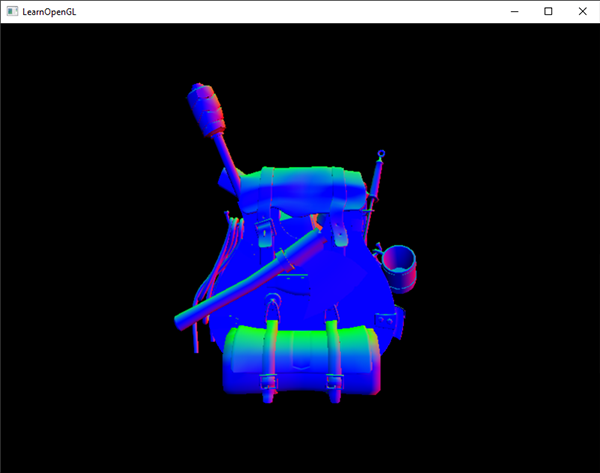

# 调试

原文    | [Debugging](http://learnopengl.com/#!In-Practice/Debugging)
-----   |  ----
作者    | JoeydeVries
翻译    | Krasjet
校对    | [AoZhang](https://github.com/SuperAoao)

图形编程可以带来很多的乐趣，然而如果什么东西渲染错误，或者甚至根本就没有渲染，它同样可以给你带来大量的沮丧感！由于我们大部分时间都在与像素打交道，当出现错误的时候寻找错误的源头可能会非常困难。调试(Debug)这样的**视觉**错误与往常熟悉的CPU调试不同。我们没有一个可以用来输出文本的控制台，在GLSL代码中也不能设置断点，更没有方法方便地检测GPU的运行状态。

在这篇教程中，我们将来见识几个调试OpenGL程序的技巧。OpenGL中的调试并不是很难，掌握住这些技巧对之后的学习会有非常大的帮助。

## glGetError()

当你不正确使用OpenGL的时候（比如说在绑定之前配置一个缓冲），它会检测到，并在幕后生成一个或多个用户错误标记。我们可以使用一个叫做<fun>glGetError</fun>的函数查询这些错误标记，他会检测错误标记集，并且在OpenGL确实出错的时候返回一个错误值。

```c++
GLenum glGetError();
```

当<fun>glGetError</fun>被调用时，它要么会返回错误标记之一，要么返回无错误。<fun>glGetError</fun>会返回的错误值如下：

| 标记 | 代码 | 描述 |
| :------: | :------: | :------: |
| GL_NO_ERROR | 0 | 自上次调用<fun>glGetError</fun>以来没有错误 |
| GL_INVALID_ENUM | 1280 | 枚举参数不合法 |
| GL_INVALID_VALUE | 1281 | 值参数不合法 |
| GL_INVALID_OPERATION | 1282 | 一个指令的状态对指令的参数不合法 |
| GL_STACK_OVERFLOW | 1283 | 压栈操作造成栈上溢(Overflow) |
| GL_STACK_UNDERFLOW | 1284 | 弹栈操作时栈在最低点（译注：即栈下溢(Underflow)） |
| GL_OUT_OF_MEMORY | 1285 | 内存调用操作无法调用（足够的）内存 |
| GL_INVALID_FRAMEBUFFER_OPERATION | 1286 | 读取或写入一个不完整的帧缓冲 |

在OpenGL的函数文档中你可以找到函数在错误时生成的错误代码。比如说，如果你看一下[glBindTexture](http://docs.gl/gl3/glBindTexture)函数的文档，在 *Errors* 部分中你可以看到它可能生成的所有用户错误代码。

当一个错误标记被返回的时候，将不会报告其它的错误标记。换句话说，当<fun>glGetError</fun>被调用的时候，它会清除所有的错误标记（在分布式系统上只会清除一个，见下面的注释）。这也就是说如果你在每一帧之后调用<fun>glGetError</fun>一次，它返回一个错误，但你不能确定这就是唯一的错误，并且错误的来源可能在这一帧的任意地方。

!!! important

    注意当OpenGL是分布式(Distributely)运行的时候，如在X11系统上，其它的用户错误代码仍然可以被生成，只要它们有着不同的错误代码。调用<fun>glGetError</fun>只会重置一个错误代码标记，而不是所有。由于这一点，我们通常会建议在一个循环中调用<fun>glGetError</fun>。

```c++
glBindTexture(GL_TEXTURE_2D, tex);
std::cout << glGetError() << std::endl; // 返回 0 (无错误)

glTexImage2D(GL_TEXTURE_3D, 0, GL_RGB, 512, 512, 0, GL_RGB, GL_UNSIGNED_BYTE, data);
std::cout << glGetError() << std::endl; // 返回 1280 (非法枚举)

glGenTextures(-5, textures);
std::cout << glGetError() << std::endl; // 返回 1281 (非法值)

std::cout << glGetError() << std::endl; // 返回 0 (无错误)
```

<fun>glGetError</fun>非常棒的一点就是它能够非常简单地定位错误可能的来源，并且验证OpenGL使用的正确性。比如说你获得了一个黑屏的结果但是不知道什么造成了它：是不是帧缓冲设置错误？是不是我忘记绑定纹理了？通过在整个代码库中调用<fun>glGetError</fun>，您可以快速捕获OpenGL错误开始出现的第一个地方。

默认情况下<fun>glGetError</fun>只会打印错误数字，如果你不去记忆的话会非常难以理解。通常我们会写一个助手函数来简便地打印出错误字符串以及错误检测函数调用的位置。

```c++
GLenum glCheckError_(const char *file, int line)
{
    GLenum errorCode;
    while ((errorCode = glGetError()) != GL_NO_ERROR)
    {
        std::string error;
        switch (errorCode)
        {
            case GL_INVALID_ENUM:                  error = "INVALID_ENUM"; break;
            case GL_INVALID_VALUE:                 error = "INVALID_VALUE"; break;
            case GL_INVALID_OPERATION:             error = "INVALID_OPERATION"; break;
            case GL_STACK_OVERFLOW:                error = "STACK_OVERFLOW"; break;
            case GL_STACK_UNDERFLOW:               error = "STACK_UNDERFLOW"; break;
            case GL_OUT_OF_MEMORY:                 error = "OUT_OF_MEMORY"; break;
            case GL_INVALID_FRAMEBUFFER_OPERATION: error = "INVALID_FRAMEBUFFER_OPERATION"; break;
        }
        std::cout << error << " | " << file << " (" << line << ")" << std::endl;
    }
    return errorCode;
}
#define glCheckError() glCheckError_(__FILE__, __LINE__) 
```

防止你不知道`__FILE__`和`__LINE__`这两个预处理指令(Preprocessor Directive)是什么，它们会在编译的时候被替换成编译时对应的文件与行号。如果我们坚持在代码中使用大量<fun>glGetError</fun>的调用，这就会让我们更加准确地知道哪个<fun>glGetError</fun>调用返回了错误（译注：记得<fun>glGetError</fun>显示的错误会发生在该次调用与上次调用之间，如果间隔太大的话需要检查的地方就太多了）。

```c++
glBindBuffer(GL_VERTEX_ARRAY, vbo);
glCheckError(); 
```

这会给我们以下的输出：


<fun>glGetError</fun>并不能帮助你很多，因为它返回的信息非常简单，但不可否认它经常能帮助你检查笔误或者快速定位错误来源。总而言之，是一个非常简单但有效的工具。

## 调试输出

虽然没有<fun>glGetError</fun>普遍，但一个叫做<def>调试输出</def>(Debug Output)的OpenGL拓展是一个非常有用的工具，它在4.3版本之后变为了核心OpenGL的一部分。通过使用调试输出拓展，OpenGL自身会直接发送一个比起<fun>glGetError</fun>更为完善的错误或警告信息给用户。它不仅提供了更多的信息，也能够帮助你使用调试器(Debugger)捕捉错误源头。

!!! important

    调试输出自4.3版本变为核心OpenGL的一部分，这也就是说你可以在任意运行OpenGL 4.3及以上版本的机器中找到这一功能。如果OpenGL低于这一版本，你可以可以查询`ARB_debug_output `或者`AMD_debug_output`拓展来获取它的功能。注意OS X好像不支持调试输出功能（从网上看到的，我暂时还没有测试。如果我错了请告诉我一下）

要想开始使用调试输出，我们先要在初始化进程中从OpenGL请求一个调试输出上下文。这个进程根据你的窗口系统会有所不同，这里我们只会讨论在GLFW中配置，但你可以在教程最后的附加资源处找到其它系统的相关资料。

### GLFW中的调试输出

在GLFW中请求一个调试输出非常简单，我们只需要传递一个提醒到GLFW中，告诉它我们需要一个调试输出上下文即可。我们需要在调用<fun>glfwCreateWindow</fun>之前完成这一请求。

```c++
glfwWindowHint(GLFW_OPENGL_DEBUG_CONTEXT, true);
```

一旦GLFW初始化完成，如果我们使用的OpenGL 版本为4.3或以上的话我们就有一个调试上下文了，如果不是的话则祈祷系统仍然能够请求一个调试上下文吧。如果还是不行的话我们必须使用它的OpenGL拓展来请求调试输出。

!!! important

    在调试上下文中使用OpenGL会明显更缓慢一点，所以当你在优化或者发布程序之前请将这一GLFW调试请求给注释掉。

要检查我们是否成功地初始化了调试上下文，我们可以对OpenGL进行查询：

```c++
GLint flags; glGetIntegerv(GL_CONTEXT_FLAGS, &flags);
if (flags & GL_CONTEXT_FLAG_DEBUG_BIT)
{
    // 初始化调试输出 
}
```

调试输出工作的方式是这样的，我们首先将一个错误记录函数的回调（类似于GLFW输入的回调）传递给OpenGL，在这个回调函数中我们可以自由地处理OpenGL错误数据，在这里我们将输出一些有用的错误数据到控制台中。下面是这个就是OpenGL对调试输出所期待的回调函数的原型：

```c++
void APIENTRY glDebugOutput(GLenum source, GLenum type, unsigned int id, GLenum severity, 
                            GLsizei length, const char *message, const void *userParam);
```

有了这一大堆的数据，我们可以创建一个非常有用的错误打印工具：

```c++
void APIENTRY glDebugOutput(GLenum source, 
                            GLenum type, 
                            unsigned int id, 
                            GLenum severity, 
                            GLsizei length, 
                            const char *message, 
                            void *userParam)
{
    // 忽略一些不重要的错误/警告代码
    if(id == 131169 || id == 131185 || id == 131218 || id == 131204) return; 

    std::cout << "---------------" << std::endl;
    std::cout << "Debug message (" << id << "): " <<  message << std::endl;

    switch (source)
    {
        case GL_DEBUG_SOURCE_API:             std::cout << "Source: API"; break;
        case GL_DEBUG_SOURCE_WINDOW_SYSTEM:   std::cout << "Source: Window System"; break;
        case GL_DEBUG_SOURCE_SHADER_COMPILER: std::cout << "Source: Shader Compiler"; break;
        case GL_DEBUG_SOURCE_THIRD_PARTY:     std::cout << "Source: Third Party"; break;
        case GL_DEBUG_SOURCE_APPLICATION:     std::cout << "Source: Application"; break;
        case GL_DEBUG_SOURCE_OTHER:           std::cout << "Source: Other"; break;
    } std::cout << std::endl;

    switch (type)
    {
        case GL_DEBUG_TYPE_ERROR:               std::cout << "Type: Error"; break;
        case GL_DEBUG_TYPE_DEPRECATED_BEHAVIOR: std::cout << "Type: Deprecated Behaviour"; break;
        case GL_DEBUG_TYPE_UNDEFINED_BEHAVIOR:  std::cout << "Type: Undefined Behaviour"; break; 
        case GL_DEBUG_TYPE_PORTABILITY:         std::cout << "Type: Portability"; break;
        case GL_DEBUG_TYPE_PERFORMANCE:         std::cout << "Type: Performance"; break;
        case GL_DEBUG_TYPE_MARKER:              std::cout << "Type: Marker"; break;
        case GL_DEBUG_TYPE_PUSH_GROUP:          std::cout << "Type: Push Group"; break;
        case GL_DEBUG_TYPE_POP_GROUP:           std::cout << "Type: Pop Group"; break;
        case GL_DEBUG_TYPE_OTHER:               std::cout << "Type: Other"; break;
    } std::cout << std::endl;
    
    switch (severity)
    {
        case GL_DEBUG_SEVERITY_HIGH:         std::cout << "Severity: high"; break;
        case GL_DEBUG_SEVERITY_MEDIUM:       std::cout << "Severity: medium"; break;
        case GL_DEBUG_SEVERITY_LOW:          std::cout << "Severity: low"; break;
        case GL_DEBUG_SEVERITY_NOTIFICATION: std::cout << "Severity: notification"; break;
    } std::cout << std::endl;
    std::cout << std::endl;
}
```

当调试输出检测到了一个OpenGL错误，它会调用这个回调函数，我们将可以打印出非常多的OpenGL错误信息。注意我们忽略掉了一些错误代码，这些错误代码一般不能给我们任何有用的信息（比如NVidia驱动中的`131185`仅告诉我们缓冲成功创建了）。

既然我们已经有了回调函数，那么是时候初始化调试输出了：

```c++
if (flags & GL_CONTEXT_FLAG_DEBUG_BIT)
{
    glEnable(GL_DEBUG_OUTPUT);
    glEnable(GL_DEBUG_OUTPUT_SYNCHRONOUS); 
    glDebugMessageCallback(glDebugOutput, nullptr);
    glDebugMessageControl(GL_DONT_CARE, GL_DONT_CARE, GL_DONT_CARE, 0, nullptr, GL_TRUE);
} 
```

在这里，我们告诉OpenGL启用调试输出，调用<fun>glEnable(GL_DEBUG_SYNCRHONOUS)</fun>告诉OpenGL在发生错误时直接调用回调函数。

### 过滤调试输出

有了<fun>glDebugMessageControl</fun>，你可以潜在地过滤出你需要的错误类型。在这里我们不打算过滤任何来源，类型或者严重等级。如果我们仅希望显示OpenGL API的高严重等级错误消息，你可以设置为以下这样：

```c++
glDebugMessageControl(GL_DEBUG_SOURCE_API, 
                      GL_DEBUG_TYPE_ERROR, 
                      GL_DEBUG_SEVERITY_HIGH,
                      0, nullptr, GL_TRUE); 
```

有了我们的配置，如果你的上下文支持调试输出的话，每个不正确的OpenGL指令都会打印出一大堆的有用数据。


### 回溯调试错误源

使用调试输出另一个很棒的技巧就是你可以很容易找出错误发生的准确行号或者调用。通过在<fun>DebugOutput</fun>中特定的错误类型上（或者在函数的顶部，如果你不关心类型的话）设置一个断点，调试器将会捕捉到抛出的错误，你可以往上查找调用栈直到找到消息发出的源头。


这需要一些手动操作，但如果你大致知道你在寻找什么，这会非常有用，能够帮助你快速定位错误。

### 自定义错误输出

除了仅仅是阅读信息，我们也可以使用<fun>glDebugMessageInsert</fun>将信息推送到调试输出系统：

```c++
glDebugMessageInsert(GL_DEBUG_SOURCE_APPLICATION, GL_DEBUG_TYPE_ERROR, 0,                       
                     GL_DEBUG_SEVERITY_MEDIUM, -1, "error message here"); 
```

如果你正在利用其它使用调试输出上下文的程序或OpenGL代码进行开发，这会非常有用。其它的开发者能快速了解你自定义OpenGL代码中任何**报告出来的**Bug。

总而言之，调试输出（如果你能使用它）对与快速捕捉错误是非常有用的，完全值得你花一点时间来配置，它能够省下你非常多的开发时间。你可以在[这里](http://learnopengl.com/code_viewer_gh.php?code=src/7.in_practice/1.debugging/debugging.cpp)找到源码，里面<fun>glGetError</fun>和调试输出上下文都有配置；看看你是否能够修复所有的错误。

## 调试着色器输出

对于GLSL来说，我们不能访问像是<fun>glGetError</fun>这样的函数，也不能通过步进的方式运行着色器代码。如果你得到一个黑屏或者完全错误的视觉效果，通常想要知道着色器代码是否有误会非常困难。是的，我们是有编译错误报告来报告语法错误，但是捕捉语义错误又是一大难题。

一个经常使用的技巧就是将着色器程序中所有相关的变量直接发送到片段着色器的输出通道，以评估它们。通过直接输出着色器变量到输出颜色通道，我们通常可以通过观察视觉结果来获取有用的信息。比如说，如果我们想要检查一个模型的法向量是否正确，我们可以把它们（可以是变换过的也可以是没有变换过的）从顶点着色器传递到片段着色器中，在片段着色器中我们会用以下这种方式输出法向量：

```c++
#version 330 core
out vec4 FragColor;
in vec3 Normal;
[...]
  
void main()
{
    [...]
    FragColor.rgb = Normal;
    FragColor.a = 1.0f;
}
```

通过输出一个（非颜色）变量到这样子的输出颜色通道中，我们可以快速审查变量是否显示着正确的值。举例来说，如果最后的视觉效果完全是黑色的，则很清楚表明法向量没有正确地传递至着色器中。当它们都显示出来的时候，检查它们（大概）正确与否就会变得非常简单。



从视觉效果来看，我们可以看见世界空间的法向量应该是正确的，因为背包模型的右侧大部分都是红色的（这表明法线大概（正确地）指向正x轴），同样的，背包的前方大部分都为蓝色，即正z轴方向。

这一方法可以很容易拓展到你想要测试的任何变量。一旦你卡住了或者怀疑你的着色器有问题，尝试显示多个变量和/或中间结果，看看哪部分算法什么的没加上或者有错误。

## OpenGL GLSL参考编译器

每一个驱动都有它自己的怪癖。比如说NVIDIA驱动会更宽容一点，通常会忽略一些限制或者规范，而ATI/AMD驱动则通常会严格执行OpenGL规范（在我看来会更好一点）。问题是在一台机器上的着色器到另一台机器上可能就由于驱动差异不能正常工作了。

通过多年的经验你会最终能够知道不同GPU供应商之间的细微差别，但如果你想要保证你的着色器代码在所有的机器上都能运行，你可以直接对着官方的标准使用OpenGL的GLSL[参考编译器](https://www.khronos.org/opengles/sdk/tools/Reference-Compiler/)（Reference Compiler）来检查。你可以从[这里](https://www.khronos.org/opengles/sdk/tools/Reference-Compiler/)下载所谓的<def>GLSL语言校验器</def>(GLSL Lang Validator)的可执行版本，或者从[这里](https://github.com/KhronosGroup/glslang)找到完整的源码。

有了这个GLSL语言校验器，你可以很方便的检查你的着色器代码，只需要把着色器文件作为程序的第一个参数即可。注意GLSL语言校验器是通过下列固定的后缀名来决定着色器的类型的：

- **.vert**：顶点着色器(Vertex Shader)
- **.frag**：片段着色器(Fragment Shader)
- **.geom**：几何着色器(Geometry Shader)
- **.tesc**：细分控制着色器(Tessellation Control Shader)
- **.tese**：细分计算着色器(Tessellation Evaluation Shader)
- **.comp**：计算着色器(Compute Shader)

运行GLSL参考编译器非常简单：

```bash
glsllangvalidator shaderFile.vert
```

注意如果没有检测到错误的话则没有输出。对一个不正确的顶点着色器使用GLSL参考编译器进行测试会输出以下结果：


它不会显示AMD，NVidia，以及Intel的GLSL编译器之间的细微差别，也不能保证你的着色器完全没有Bug，但它至少能够帮你对着直接的GLSL规范进行检查。

## 帧缓冲输出

你的调试工具箱中另外一个技巧就是在OpenGL程序中一块特定区域显示帧缓冲的内容。你可能会比较频繁地使用[帧缓冲](../04 Advanced OpenGL/05 Framebuffers.md)，但由于帧缓冲的操作通常在后台进行，有时候想要知道出什么问题会非常困难。在你的程序中显示帧缓冲的内容是一个很有用的技巧，帮助你快速检查错误。

!!! important

    注意，这里讨论的帧缓冲显示内容（附件）仅能在纹理附件上使用，而不能应用于渲染缓冲对象。

通过使用一个非常简单，只显示纹理的着色器，我们可以写一个助手函数快速在屏幕右上角显示任何纹理。

```c++
// 顶点着色器
#version 330 core
layout (location = 0) in vec2 position;
layout (location = 1) in vec2 texCoords;

out vec2 TexCoords;

void main()
{
    gl_Position = vec4(position, 0.0f, 1.0f);
    TexCoords = texCoords;
}

// 片段着色器
#version 330 core
out vec4 FragColor;
in  vec2 TexCoords;

uniform sampler2D fboAttachment;

void main()
{
    FragColor = texture(fboAttachment, TexCoords);
}
```

```c++
void DisplayFramebufferTexture(GLuint textureID)
{
    if(!notInitialized)
    {
        // 在屏幕右上角，使用NDC顶点坐标初始化着色器和VAO
        [...]
    }

    glActiveTexture(GL_TEXTURE0);  	
    glUseProgram(shaderDisplayFBOOutput);
        glBindTexture(GL_TEXTURE_2D, textureID);
        glBindVertexArray(vaoDebugTexturedRect);
            glDrawArrays(GL_TRIANGLES, 0, 6);
        glBindVertexArray(0);
    glUseProgram(0);
}

int main()
{
    [...]
    while (!glfwWindowShouldClose(window))
    {
        [...]
        DisplayFramebufferTexture(fboAttachment0);

        glfwSwapBuffers(window);
    }
}
```

这将在屏幕右上角给你一个小窗口，用来调试帧缓冲的输出。比如你想要检查延迟渲染器的几何渲染阶段中的法向量是否正确，使用这个会非常方便：


你当然可以拓展这个函数以支持渲染更多的纹理。这个方法能够非常快速地让你对帧缓冲内容有着持续的反馈。

## 外部调试软件

当上面所有介绍到的技巧都不能使用的时候，我们仍可以使用一个第三方的工具来帮助我们调试。第三方应用通常将它们自己注入到OpenGL驱动中，并且能够拦截各种OpenGL调用，给你大量有用的数据。这些工具可以在很多方面帮助到你：对OpenGL函数使用进行性能测试，寻找瓶颈，检查缓冲内存，显示纹理和帧缓冲附件。如果你正在写（大规模）产品代码，这类的工具在开发过程中是非常有用的。

我在下面列出了一些流行的调试工具，选几个尝试一下，看看哪个最适合你。

### RenderDoc

RenderDoc是一个很棒的（完全[开源](https://github.com/baldurk/renderdoc)的）独立调试工具。你只需要设置捕捉的程序以及工作目录就行了。你的程序会正常运行，当你想要检查一个特定的帧的时候，你只需要让RenderDoc在程序当前状态下捕捉一个或多个帧即可。在捕捉的帧当中，你可以观察管线状态，所有OpenGL指令，缓冲储存，以及使用的纹理。


### CodeXL

[CodeXL](https://gpuopen.com/compute-product/codexl/)是由AMD开发的一款GPU调试工具，它有独立版本也有Visual Studio插件版本。CodeXL可以给你非常多的信息，对于图形程序的性能测试也非常有用。CodeXL在NVidia与Intel的显卡上也能运行，不过会不支持OpenCL调试。


我没有太多的CodeXL使用经验，我个人觉得RenderDoc会更容易使用一点，但我仍把它列在这里，因为它仍是一个非常可靠的工具，并且主要是由最大的GPU制造商之一开发的。

### NVIDIA Nsight

NVIDIA流行的[Nsight](https://developer.nvidia.com/nvidia-nsight-visual-studio-edition) GPU调试工具并不是一个独立程序，而是一个Visual Studio IDE或者Eclipse IDE的插件 (NVIDIA现在也提供[独立版本](https://developer.nvidia.com/nsight-graphics)了)。Nsight插件对图形开发者来说非常容易使用，因为它给出了GPU用量，逐帧GPU状态大量运行时的统计数据。

当你在Visual Studio（或Eclipse）使用Nsight的调试或者性能测试指令启动程序的时候，Nsight将会在程序自身中运行。Nsight非常棒的一点就是它在你的程序中渲染了一套GUI系统，你可以使用它获取你程序各种各样有用的信息，可以是运行时也可以是逐帧分析。


Nsight是一款非常有用的工具，在我看来比上述其它工具都有更好的表现，但它仍有一个非常重要的缺点，它只能在NVIDIA的显卡上工作。如果你正在使用一款NVIDIA的显卡（并且使用Visual Studio），Nsight是非常值得一试的。

我知道我可能遗漏了一些其它的调试工具（比如我还能想到有Valve的[VOGL](https://github.com/ValveSoftware/vogl)和[APItrace](https://apitrace.github.io/)），但我觉得这个列表已经给你足够多的工具来实验了。

## 附加资源

- [为什么你的代码会产生一个黑色窗口](http://retokoradi.com/2014/04/21/opengl-why-is-your-code-producing-a-black-window/)：Reto Koradi列举了你的屏幕没有产生任何输出的可能原因。
- [调试输出](http://vallentinsource.com/opengl/debug-output)：Vallentin Source写的一份非常详细的调试输出教程，里面有在多个窗口系统中配置调试上下文的详细信息。